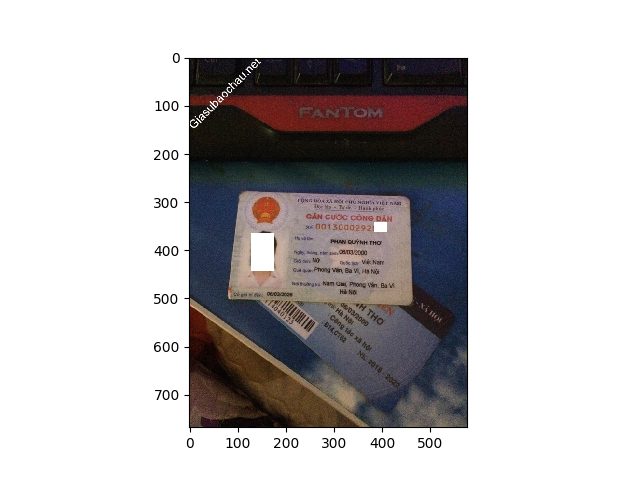
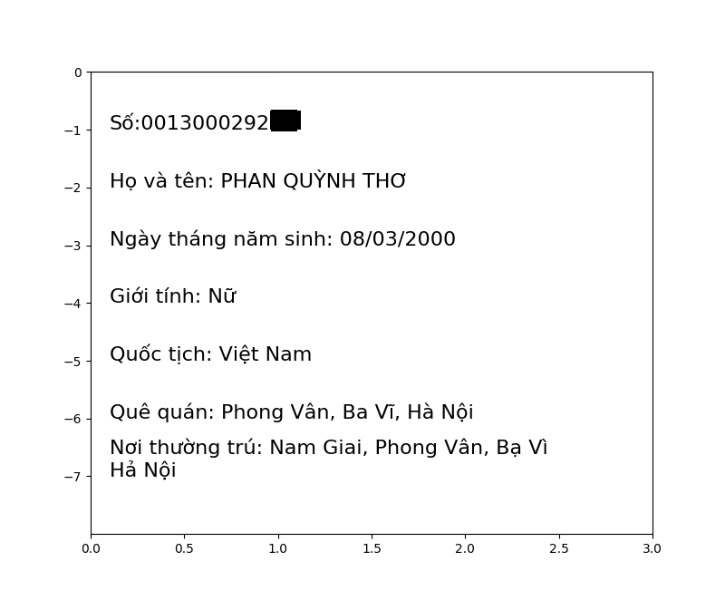

# vietnamese-id-card-ocr
Using deep learning with computer vison algorithms and Tesseract to extract information from Vietnam ID card
### Setup on Ubuntu 18.04

Tesseract 4
```
sudo apt install tesseract-ocr
sudo apt install libtesseract-dev
sudo apt install tesseract-ocr-vie
```

Python 3 environment
```
virtualenv -p python3 ~/idcard-ocr
source ~/idcard-ocr/bin/activate
```

Dependencies

```
pip install -r requirements.txt
```

### Usage

```
python main.py -i path/to/image
```
### Demo


